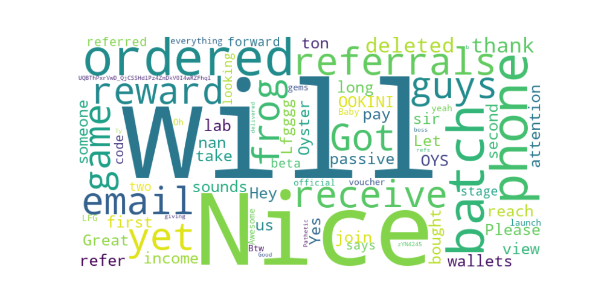

# Twitter Comment Scraper and Sentiment Analysis

This project scrapes Twitter comments for a specified post, processes the data by cleaning and translating the text, and performs sentiment analysis using various Python libraries. It generates a CSV file with the cleaned comments, performs sentiment analysis, extracts key elements, and generates a word cloud of the most mentioned topics.

## Features

- Scrape a Twitter post and its comments using Selenium.
- Clean and preprocess the scraped data by removing nonsensical data, URLs, and long substrings.
- Translate non-English comments to English using the `deep_translator` library.
- Perform sentiment analysis on the comments using `TextBlob`.
- Extract key topics from the comments.
- Generate a word cloud to visualize the most frequently mentioned topics.
- Generate explanations for key topics using `langchain` and `OpenAI GPT-4`.

## Requirements

Make sure you have the following Python libraries installed:

```bash
pip install selenium pandas re textblob wordcloud matplotlib deep-translator langchain_openai scikit-learn
```

##  SAMEPLE ANSWER AND SENTIMENT ANALYSIS

[sentiment_analysis_summary_sample.txt](SentimentAnalysisX/answers_Jul05.txt)


